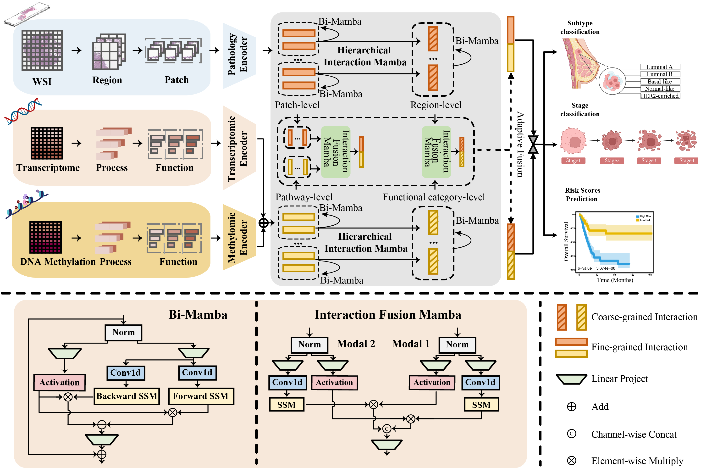

# **CancerMul: A Hierarchical Mamba model for Cancer Diagnosis and Prognosis based on multimodal data**

  

## Introduction of CancerMul

In this study, we proposed a Mamba model with multi-grained multimodal interaction, named CancerMul, for subtype classification, staging, and survival prediction of human cancers. CancerMul was implemented with a Hierarchical Interaction Mamba (HIM) module that facilitated efficient intra-modal interactions at different granularities, thereby capturing more detailed local features as well as rich global representations. In addition, an Interaction Fusion Mamba (IFM) module was used for cascaded inter-modal interactive fusion, yielding more comprehensive features for multi-task prediction. An evaluation of four cancer types showed that CancerMul not only outperformed existing methods in performance and efficiency, but also provides interpretable analyses of morphological and molecular features related to prognosis and diagnosis for patients across multiple cancer types.

## Installation
Clone the repository or download the ZIP file of the repository. The repository contains the model and data, which are somewhat large. Downloading the ZIP file might be faster. Cloning the repository takes about 10 minutes. 

a. Create a conda virtual environment and activate it.

```shell
conda create -n cancermul python=3.10.13
git clone https://github.com/xmuyulab/BPformer.git
cd CancerMul
conda activate cancermul
```

b. Next step is to install a set of required python packages

```shell
pip install --requirement requirements.txt
```

💡 : This conda environment is using GPU-accelerated PyTorch. To use this environment, the CUDA version must be 12.0 or higher.

## Preparation of input data

a. Each sample must include pathology images, transcriptomic data, and DNA methylation data, as well as clinical information such as subtype classification, staging, survival time, and survival status. The prepared data can be organized according to the format provided in the example.


(1) For whole slide images (WSIs) in .svs format, we first crop them into regions of size 4096×4096. (Taking BLCA cancer type as an example.)

```
python deepzoom_tiler_BLCA.py -d ./TCGA_Slide/TCGA-BLCA/ -s 4096 -m 0 -b 20
```


(2)  For pathological images, each 4096×4096 region is further divided into patches of size 256×256.

```
python split_4096_256_BLCA.py 
```


(3) For each 256×256 patch, we employ the CTransPath model to extract its embedding features.

```
python compute_feats_BLCA.py
```

💡 : The trained CTransPath model is saved in the file `ctranspath.pth`, which can be download in https://drive.google.com/drive/folders/1p-DgrY3Rlmqen14ahouhGhOXkQZ7SNI-


(4) The purpose of discretizing survival data is to divide continuous survival times into multiple intervals (bins) to facilitate subsequent classification tasks or group analysis in the model. This approach effectively reduces the complexity of the data while improving the differentiation between different survival states.

```
python survival_process.py
```


b. Prepare biological prior knowledge that includes both pathway information and functional categorization of pathways.

```
KEGG_RNA_DNA.txt
```

## Model training

We performed five-fold cross-validation for each cancer type to obtain results for subtype classification, staging determination, and survival prediction.

CancerMul provides embedding of pathological images for 20 samples, which is available at https://drive.google.com/drive/folders/1vPth8UBLX9bu83YR921e7IjMej9SkRXM.

```shell
CUDA_VISIBLE_DEVICES=7 python CancerMul_main.py --agg no --feats_size 768 --model mambamil
```

## Contact

If you encounter any problems, bugs, or have any questions, feel free to submit an issue. Alternatively, please contact [xiejiajing@stu.xmu.edu.cn](mailto:xiejiajing@stu.xmu.edu.cn).
